# Expense Tracker System

A complete Personal & Family Budget Manager built with JavaFX. This application provides robust expense tracking, family management, monthly reporting, and budget handling capabilities, entirely designed with a scalable multi-tier architecture.

*Note: I originally completed this project during my 3rd semester around October, but I am only publishing it here at the end. It's a fairly simple project—contributions are welcome! Feel free to clone it, build your own applications, add features, etc.*

## Features

*   **Personal Dashboard**: Track your daily and monthly expenses with ease.
*   **Family Management**: Add family members, allocate shared expenses, and manage roles.
*   **Monthly Reports**: Generate visual reports on how your budget is spent to optimize your finances.
*   **Budgeting system**: Define limits per category and get alerted when nearing limits.
*   **Data Persistence**: Uses local storage `.dat` files via DataStore for fast and persistent historical data.

---

## Architecture

The system is built on a strictly decoupled 3-tier architecture:

1.  **Domain (`com.expensetracker.domain`)**: Contains core models such as `User`, `Family`, `Expense`, and utilities.
2.  **Service (`com.expensetracker.service`)**: Handles the business logic like authentication, data seeding, and file I/O operations (`DataStore`).
3.  **UI (`com.expensetracker.ui`)**: Manages the JavaFX graphical interface, navigation (`SceneRouter`), and controllers.

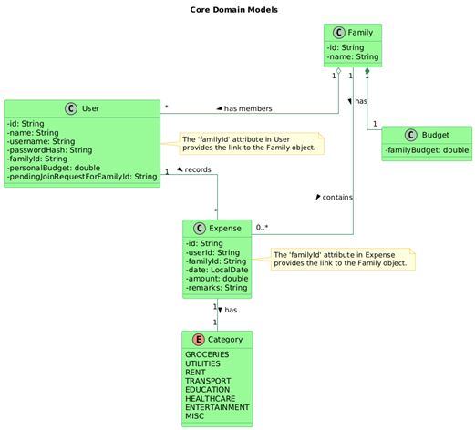

### Service Layer Interaction
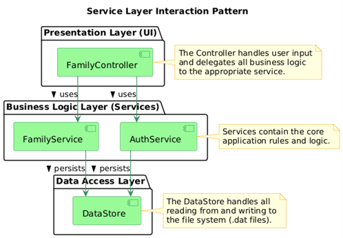


---

## Application Screenshots

### Authentication
**Login**
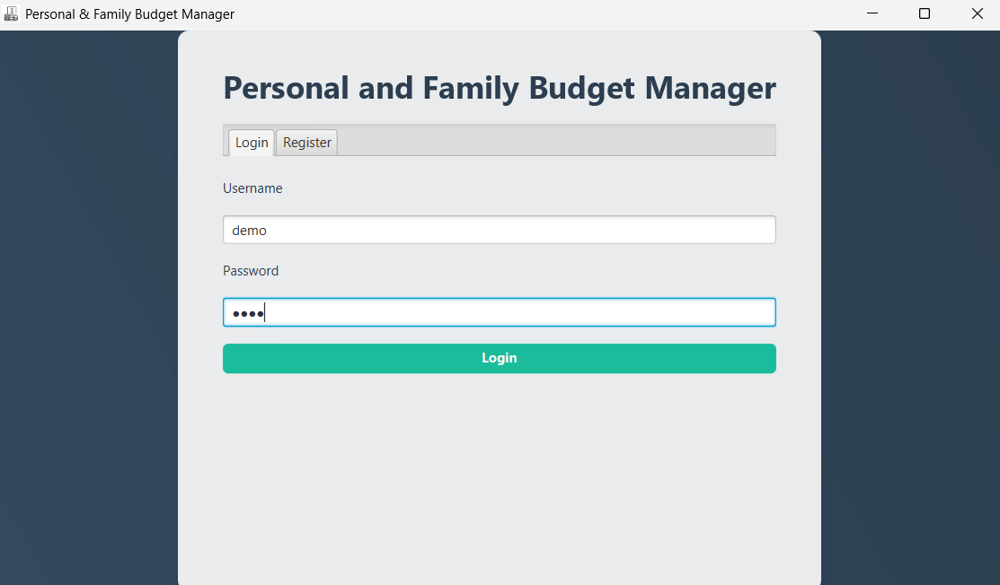

**Register**
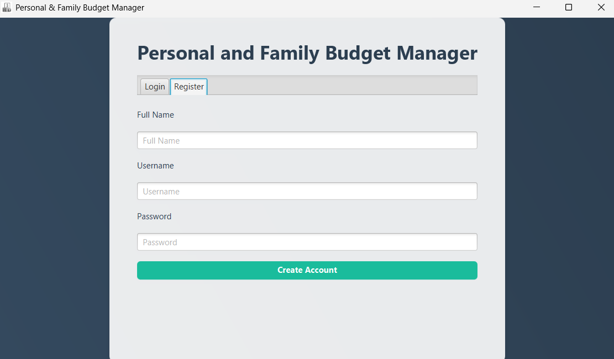

### Dashboards
**Personal Dashboard**
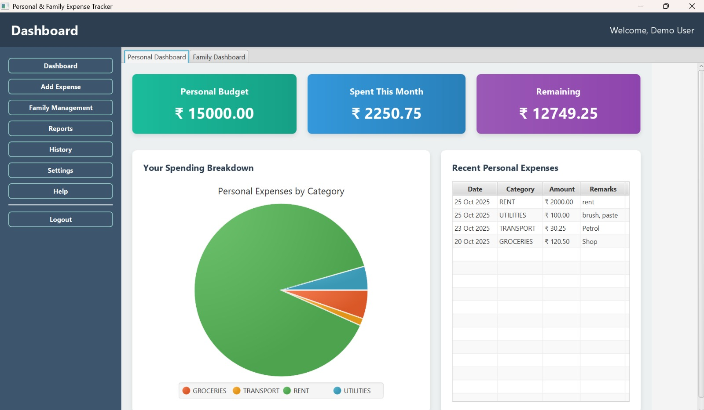

**Family Dashboard**
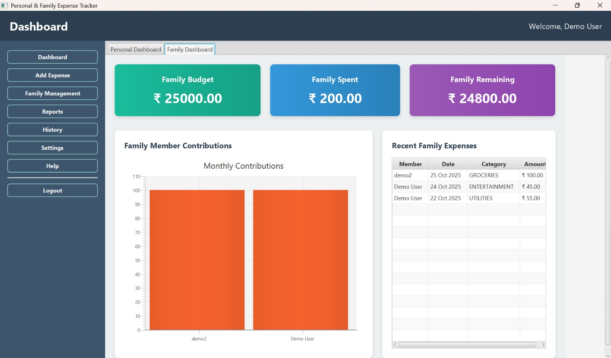

### Tracking & Management
**Add New Expense**
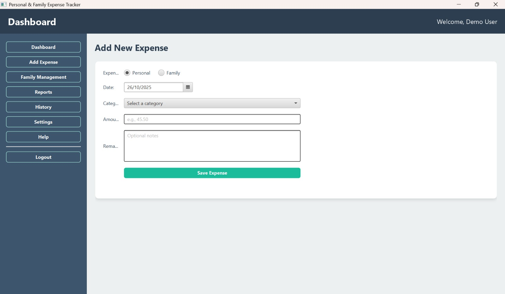

**Monthly Reports**
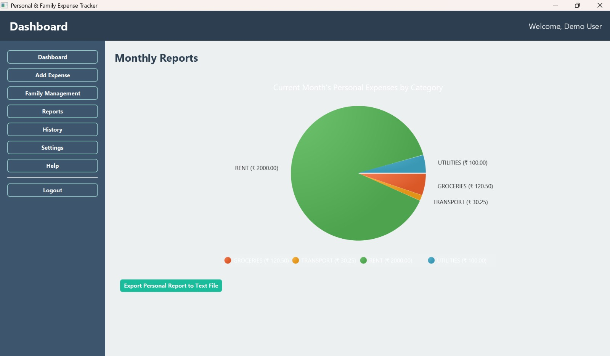

**Family Management**
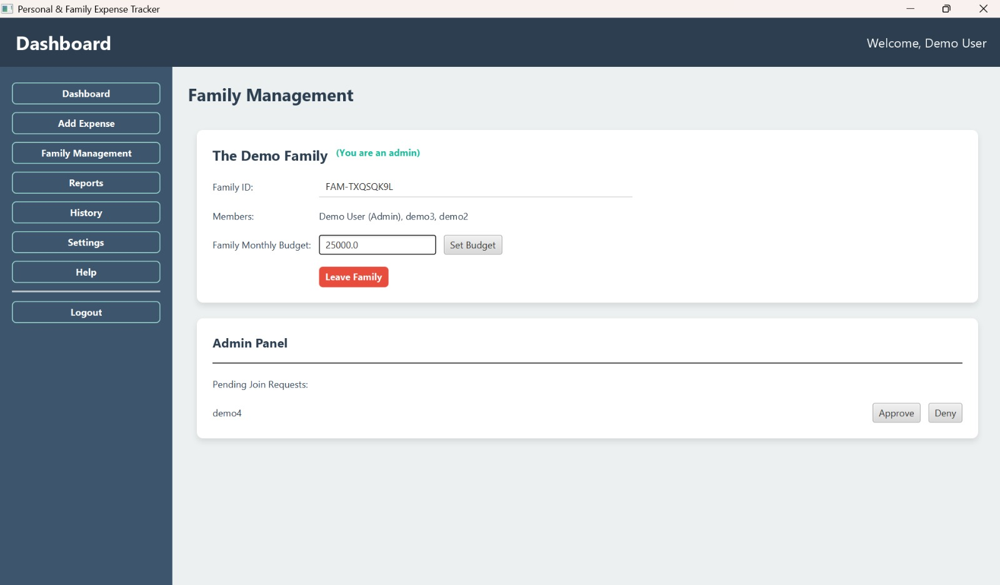

**Settings**
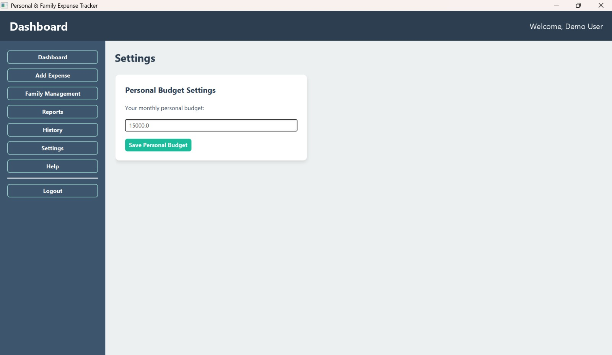

**Help**
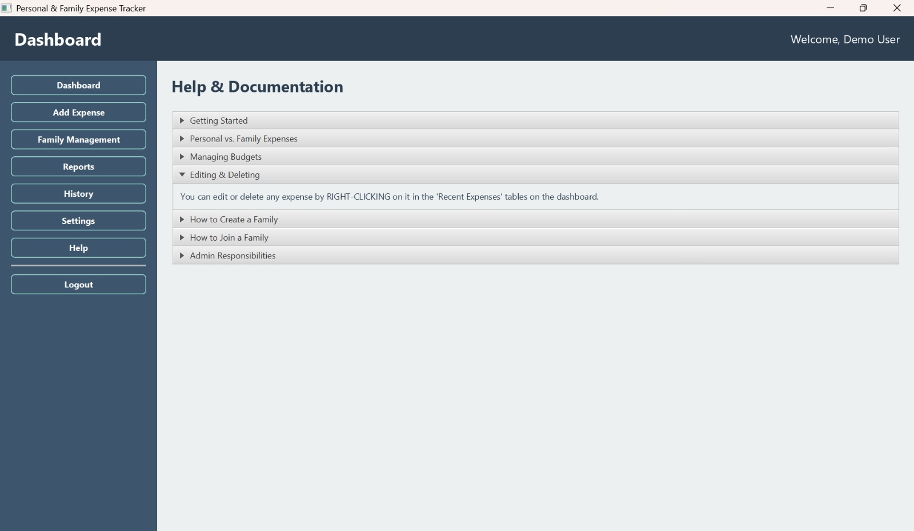

---

## How to Run

### Requirements
*   Java Development Kit (JDK) 21 or later
*   [JavaFX SDK](https://gluonhq.com/products/javafx/) (Tested with 21.0.8)

### Build Instructions

1.  **Compile the Domain Module** (Must succeed):
    ```bash
    javac -d bin/domain --module-source-path src -m domain
    ```

2.  **Compile the Service Module** (Must succeed):
    ```bash
    javac -d bin/service --module-source-path src --module-path bin -m service
    ```

3.  **Compile the UI Module**:
    Ensure `PATH_TO_FX` points to your JavaFX `lib` folder.
    
    *Command Prompt (Windows):*
    ```bash
    set PATH_TO_FX=C:\javafx-sdk-21.0.8\javafx-sdk-21.0.8\lib
    javac --module-path "bin;%PATH_TO_FX%" --add-modules javafx.controls,javafx.fxml,javafx.graphics -d bin/ui --module-source-path src -m ui
    ```

### Run Command

Once the project is successfully built, launch the application with:

```bash
set PATH_TO_FX=C:\javafx-sdk-21.0.8\javafx-sdk-21.0.8\lib
java --module-path "bin\ui;bin\service;bin\domain;%PATH_TO_FX%" --add-modules javafx.controls,javafx.fxml,javafx.graphics -m ui/com.expensetracker.ui.controller.CombinedApp
```

*Note: Change the `PATH_TO_FX` variable appropriately for your local machine's JavaFX installation path.*
